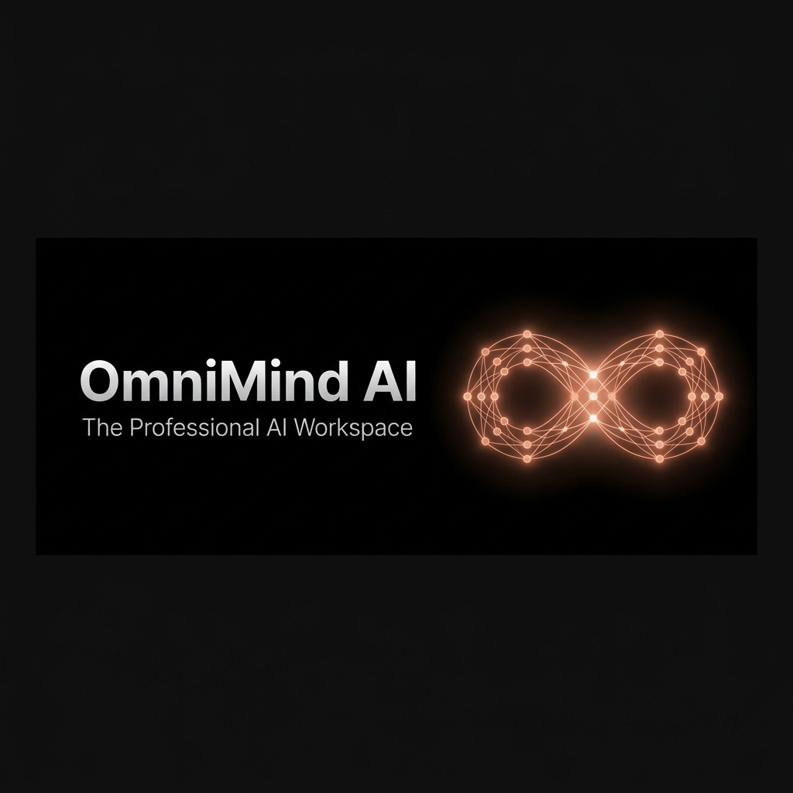
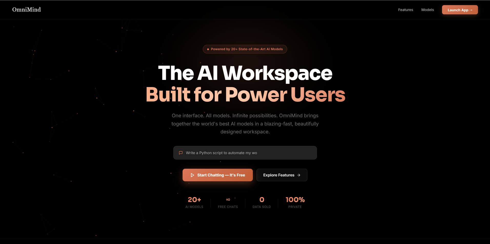
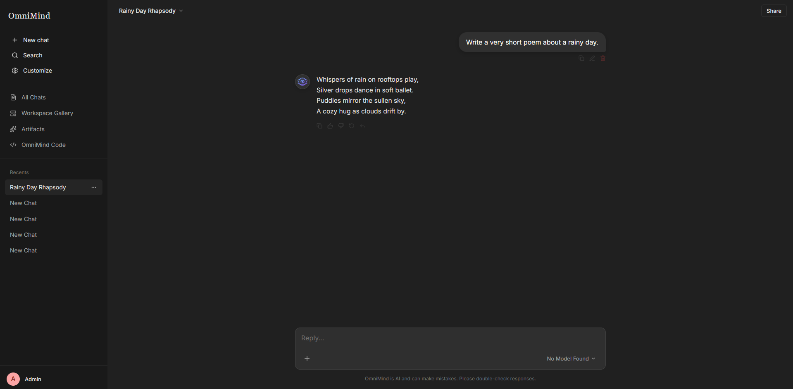

# OmniMind AI Workspace
### *The Professional-Grade AI Environment for Power Users*

---

## 🌟 The Vision
**OmniMind** is not just another chatbot; it is a high-performance **AI Workspace** designed for developers, creators, and professionals who demand a minimalist yet powerful interface. Built on a foundation of speed, visual excellence, and utility, OmniMind transforms raw AI potential into a structured project environment.

## ✨ Core Highlights

### ⚡ Interactive Artifacts (Claude-Style)
One of OmniMind's flagship features. When the AI generates code (HTML, SVG, React, etc.), a dedicated **Preview Sidebar** allows you to:
- **Live Preview**: See your code rendered in real-time.
- **Inline Editing**: Make instant tweaks directly in the chat.
- **Smart Download**: Export your snippets as production-ready files.
- **Auto-Sync**: Your edits are automatically saved back to the conversation history.

### 📁 Intelligent Project Management
Organize your intellectual labor into distinct **Projects**. 
- Group related conversations within a project context.
- High-level overview of all generated artifacts.
- Persistent workspace identity that remembers your workflow.

### 🖼️ Multimodal Intelligence
Fully equipped to handle more than just text.
- **Vision Support**: Drag and drop images for deep analysis.
- **File Processing**: Seamlessly integrate data into your prompts.

### 🎨 Human-Centric Design
- **Pitch Black Aesthetic**: A true dark mode interface (`#000000`) designed for long sessions.
- **Glassmorphic Elements**: Modern, layered UI with subtle blurs and glow effects.
- **Dynamic Greetings**: Time-aware greetings (Morning/Afternoon/Evening) for a personal touch.
- **Fluid Routing**: Instant page transitions with a custom native SPA router.

---

## 📸 Interface Preview

### Modern Homepage Experience

*A clean, distraction-free entry point to your workspace.*

### Professional AI Chat & Artifacts

*The core interaction hub where ideas turn into reality.*

---

## 🔒 Security & Privacy
- **Local Persistence**: All chat history and project data are synchronized with your local storage.
- **API Sovereignty**: You control your keys. OmniMind supports direct provider routing and professional proxy setups.

---

Developed with passion for the next generation of AI professionals.

**[Explore the Future of Work](#)**

