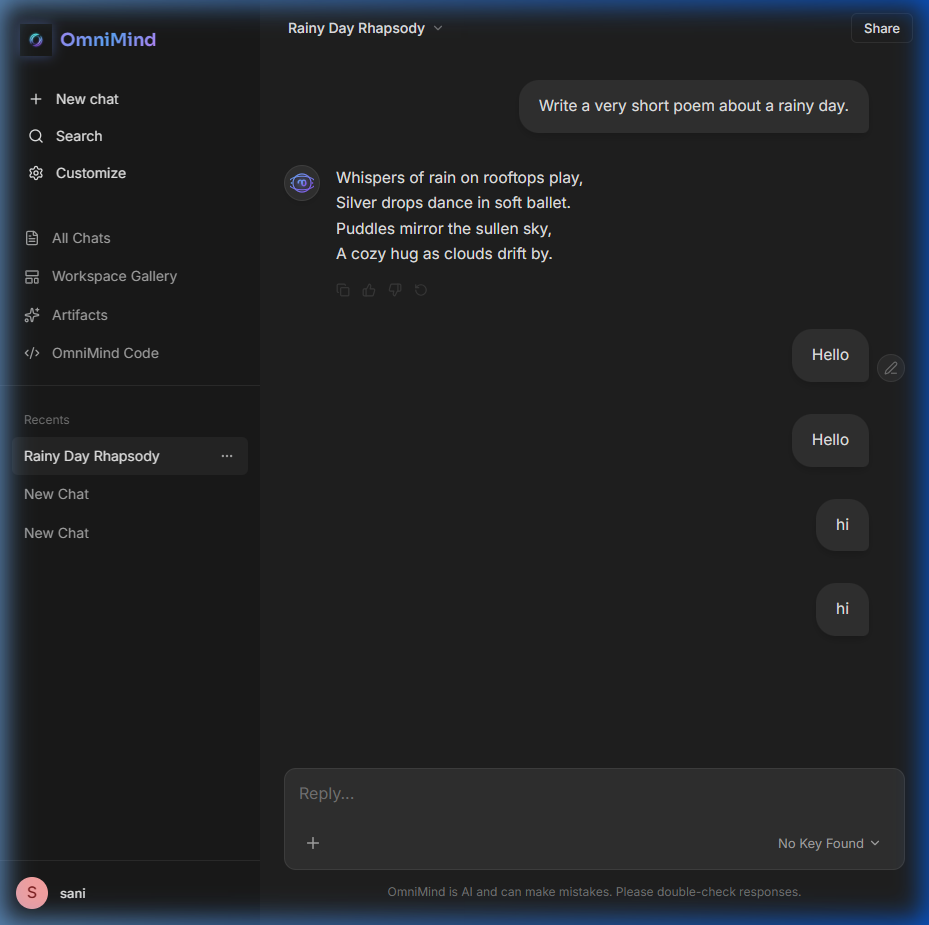

<div align="center">
  <h1 align="center">OmniMind AI Workspace</h1>
  <p align="center">
    <strong>One interface. All models. Infinite possibilities.</strong>
    <br />
    A beautifully crafted, production-grade AI Workspace built to bring the world's best models under a single, cohesive, premium UI.
    <br />
    <br />
    <a href="#features">Features</a> · 
    <a href="#installation">Installation</a> · 
    <a href="#tech-stack">Tech Stack</a> · 
    <a href="#contributing">Contributing</a>
  </p>
</div>

---

## 📸 Sneak Peek

### The OmniMind Homepage
The ultimate landing experience featuring a seamless infinite marquee of providers, interactive use cases, and prompt galleries.


### The Workspace Interface
A professional Claude-style workspace designed for deep focus. Manage chats, switch between leading LLMs, and organize your work into dynamic contexts.


### Centralized Artifacts Gallery
OmniMind automatically scans your chat logs to extract all code blocks, meticulously storing them in an easily accessible, syntax-highlighted library.


---

## ✨ Features

- **🌐 Unified AI Model Switcher:** Seamlessly toggle between GPT-4o, Claude 3.5 Sonnet, Gemini Pro, Llama 3.3, DeepSeek, and Grok natively without losing context.
- **🎨 State-of-the-Art UI/UX:** Built with true Premium aesthetics—Dark mode, glassmorphism, fluid micro-animations, and minimal typography.
- **🔗 Smart URL Routing:** Native SPA routing synchronizes with the URL bar (`/chat/:id`), creating shareable, persistent chat sessions just like Claude and ChatGPT.
- **🧩 Advanced Artifacts Library:** Automatically isolates and organizes generated code responses into a dedicated code viewer tab with 1-click copy support.
- **📂 Workspace/Project Galleries:** Group your conversations intelligently into dedicated project folders.
- **💾 Local Persistence Engine:** Complete `localStorage` caching ensures your data, profile, and conversations are safe entirely offline.
- **🔍 Native Global Search:** Quickly index and search through all historical chat messages and titles.
- **🛡️ Privacy & Security Focus:** "Local First" approach ensures data guarantees out-of-the-box.

## 🚀 Installation & Setup

Want to run OmniMind securely on your local machine?

**1. Clone the repository**
```bash
git clone https://github.com/SAZZAD-404/OmniMind.git
cd OmniMind
```

**2. Install dependencies**
```bash
npm install
```

**3. Set up Environment Variables**
Create a `.env` file in the root directory and securely add your API keys:
```env
# Master Configuration
VITE_OMNIMIND_MASTER_KEY=your_secure_master_key

# Specific Model Endpoints
VITE_OPENAI_API_KEY=your_openai_key
VITE_ANTHROPIC_API_KEY=your_anthropic_key
VITE_GOOGLE_API_KEY=your_gemini_key
```

**4. Start the Development Engine**
```bash
npm run dev
```
Navigate to `http://localhost:5173/` in your browser.

## 🛠️ Tech Stack

- **Frontend Core:** React, Vite (Lightning-fast HMR)
- **Styling Paradigm:** Custom Vanilla CSS (Dark mode optimized, Semantic design systems)
- **Iconography:** Lucide-React
- **Code Visualization:** React-Syntax-Highlighter (Prism VSC Dark Plus)
- **Routing Engine:** Custom Native History API implementation
- **State Management:** React Hooks + Browser Local Storage

## 🤝 Contributing
Contributions are always welcome. Whether you are fixing bugs or adding new core models to the UI ecosystem, feel free to open a Pull Request.  

**Built with intention by OmniMind.**
